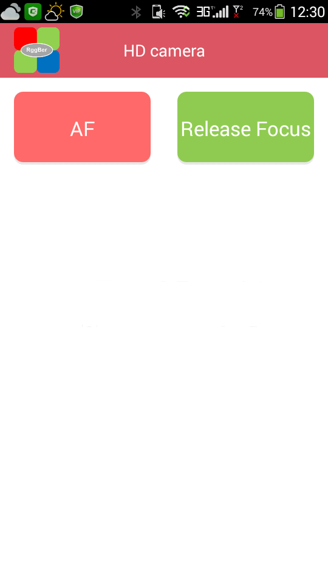
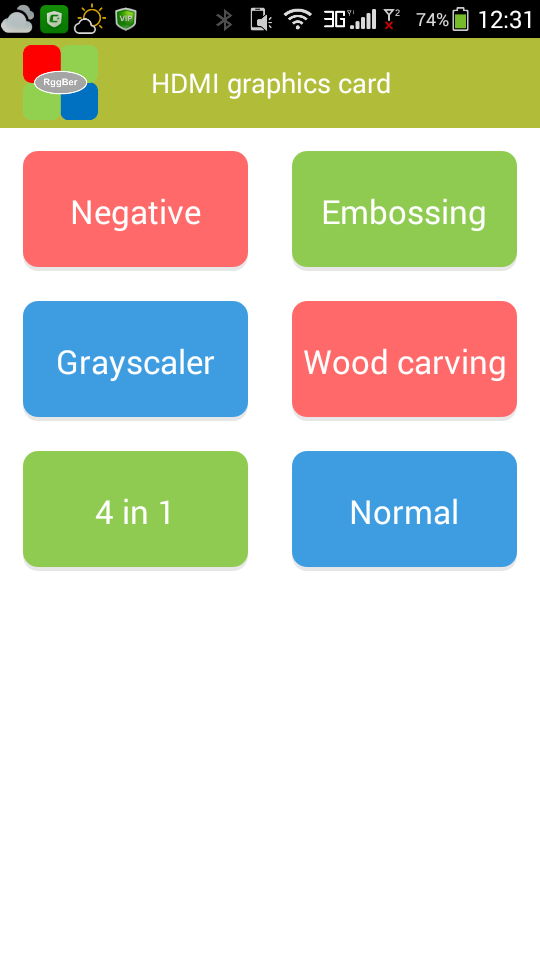
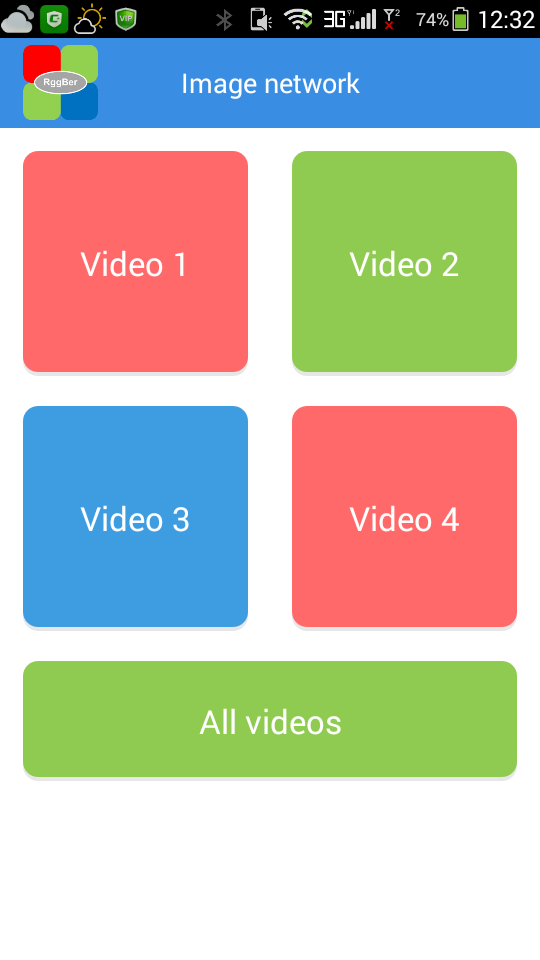
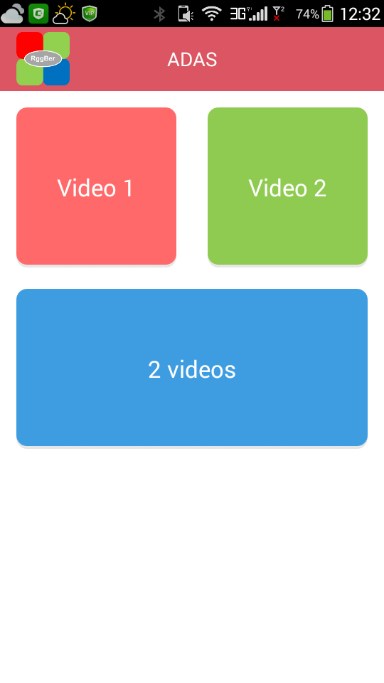

# Android App project folder

## Development tools and environment

- Android 4.0(API level 14) or above
- Development tool/IDE : [IntelliJ IDEA][1] community version
- Development environment : JAVA 1.8
- Android SDK : android-sdk--mac-r2

[1]:https://www.jetbrains.com/idea/#chooseYourEdition

---

## App UI manual

**Welcome screen**

---

**Full functional list**

  The App provides wireless controls for 4 demo projects. And also a free typing area to user for protocols test and debug.

---

**Multi-node connection**

  The App supports wireless multi-node connection which means the Android host can connect more than one wireless slave and select one of them as active node.

---

**Free typing**

  In this area, the Android host is able to send strings to RGGBer and receive strings from RGGBer.

---

**UI control of full HD camera demo project**

- AF button: Trigger OV5640's auto-focus
- Release Focus button: Release auto-focus and let the lens move back infinite.

---

**UI control of video processing demo project**

- Negative button: Trigger negative filter
- Embossing button: Trigger embossing filter
- Grayscaler button: Trigger grayscaler filter
- Wood carving button: Trigger wood carving filter
- 4 in 1 button: Process the 4 filters simultaneously
- Normal button: Bypass all the filters.

---

**UI control of multi-camera demo project**

- Video 1 ~ Video 4 button: Trigger one of the 4 video streams to full screen
- All video button: Trigger 4 videos on screen

---

**UI control of ADAS demo project**

- Video 1 and Video 2 button: Video of the 2 cameras
- 2 videos button: Trigger 2 videos on screen

---
