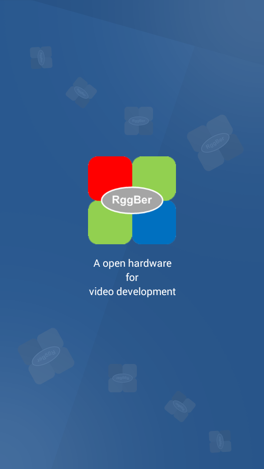
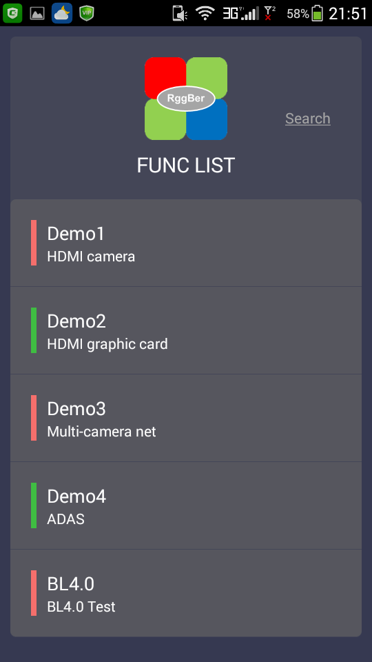
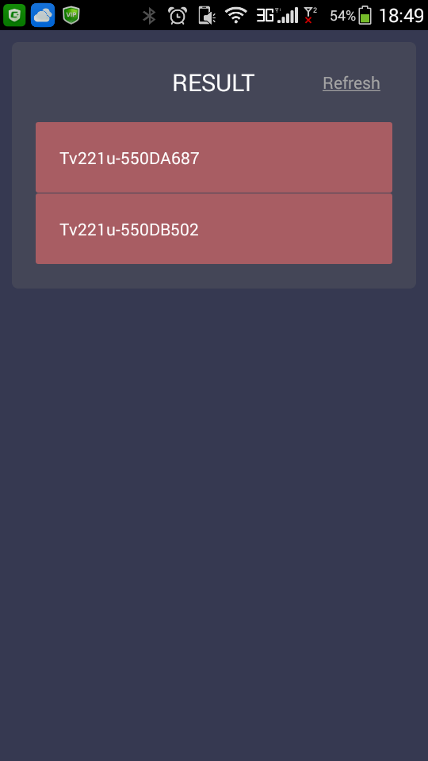
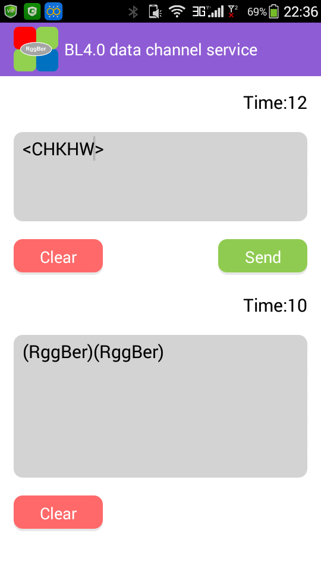

# rggber-App
Android App project folder

- Android 4.0(API level 14) or above
- Development tool/IDE : [IntelliJ IDEA][1] community version
- Development environment : JAVA 1.8
- Android SDK : android-sdk--mac-r2

[1]:https://www.jetbrains.com/idea/#chooseYourEdition

* **Welcome screen**

* **Full functional list**

* **Multi-node connection**

* **Free typing**

